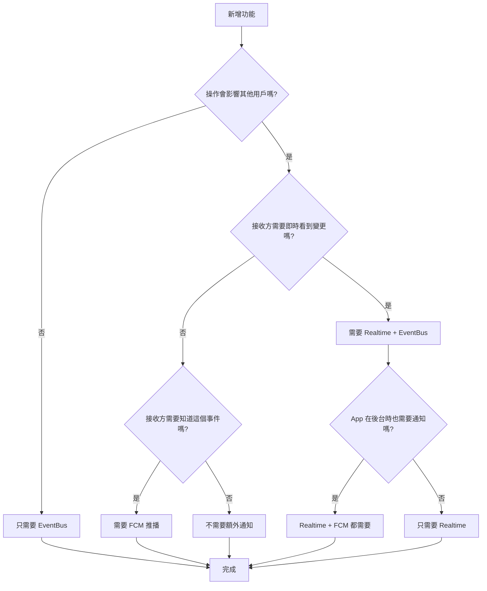

# 同步架構規格 ⭐ v4.0

> EventBus、Realtime、FCM 三種同步機制的使用指南

**建立日期**：2026-01-17  
**目標版本**：v4.0（跨用戶即時同步）  
**狀態**：✅ 已完成

---

## 📋 目錄

1. [架構總覽](#1-架構總覽)
2. [個人 EventBus（本地同步）](#2-個人-eventbus本地同步)
3. [跨用戶 Realtime → EventBus（實時同步）](#3-跨用戶-realtime--eventbus實時同步)
4. [跨用戶 FCM（推播通知）](#4-跨用戶-fcm推播通知)
5. [決策流程](#5-決策流程)
6. [已實現的同步表](#6-已實現的同步表)
7. [核心檔案索引](#7-核心檔案索引)
8. [新功能開發檢查清單](#8-新功能開發檢查清單)

---

## 1. 架構總覽

```mermaid
flowchart TB
    subgraph Local[個人 EventBus - 本地同步]
        UserOp[用戶操作] --> Controller
        Controller --> EventBus[AppEventBus]
        EventBus --> Pages[其他頁面刷新]
    end
    
    subgraph CrossUser[跨用戶 Realtime - 實時同步]
        OtherUser[其他用戶操作] --> DB[(Database)]
        DB --> Realtime[Supabase Realtime]
        Realtime --> RealtimeMgr[RealtimeManager]
        RealtimeMgr --> EventBus2[AppEventBus]
        EventBus2 --> Pages2[UI 刷新]
    end
    
    subgraph FCM[跨用戶 FCM - 推播通知]
        OtherOp[其他用戶操作] --> DB2[(Database)]
        DB2 --> Webhook[Database Webhook]
        Webhook --> EdgeFn[Edge Function]
        EdgeFn --> FCMApi[FCM API]
        FCMApi --> Notification[推播通知]
        Notification --> Router[NotificationRouter]
        Router --> Navigate[導航到對應頁面]
    end
```



### 三種機制的定位

| 機制 | 用途 | 觸發時機 | 接收方 |
|------|------|----------|--------|
| **EventBus** | 本地頁面同步 | 自己的 CRUD 操作 | 自己的其他頁面 |
| **Realtime** | 跨用戶實時同步 | 他人的操作 | 需要即時看到變更的頁面 |
| **FCM** | 跨用戶推播通知 | 重要事件 | App 在後台或關閉時 |

---

## 2. 個人 EventBus（本地同步）

### 觸發流程

```
用戶操作 → Controller.method() → Service.method() → DB
                ↓
         Controller 發布 EventBus 事件
                ↓
         其他頁面訂閱 → UI 刷新
```

### 事件類型清單

| 事件類型 | 觸發時機 | 訂閱頁面 |
|----------|----------|----------|
| `workoutCreated` | 創建訓練計畫 | HomePage, CalendarPage |
| `workoutUpdated` | 更新訓練計畫 | HomePage, CalendarPage |
| `workoutDeleted` | 刪除訓練計畫 | HomePage, CalendarPage |
| `workoutCompleted` | 完成訓練 | HomePage, StatisticsPage |
| `appointmentCreated` | 創建預約 | HomePage, BookingPage |
| `appointmentConfirmed` | 確認預約 | HomePage, BookingPage |
| `appointmentCancelled` | 取消預約 | HomePage, BookingPage |
| `appointmentRejected` | 拒絕預約 | HomePage, BookingPage |
| `availabilitySlotCreated` | 創建可預約時段 | BookingPage |
| `availabilitySlotDeleted` | 刪除可預約時段 | BookingPage |
| `clientAvailabilityCreated` | 學員可訓練時間創建 | BookingPage |
| `clientAvailabilityUpdated` | 學員可訓練時間更新 | BookingPage |
| `clientAvailabilityDeleted` | 學員可訓練時間刪除 | BookingPage |

### 代碼範例

**Controller 發布事件：**

```dart
// lib/controllers/workout_controller.dart
Future<bool> createWorkout(WorkoutPlanModel plan) async {
  final result = await _workoutService.createWorkout(plan);
  if (result != null) {
    // ⭐ 發布 EventBus 事件
    _eventBusController.publishWorkoutCreated(
      workoutId: result.id,
      userId: result.userId,
    );
    return true;
  }
  return false;
}
```

**頁面訂閱事件：**

```dart
// lib/views/pages/home/home_page.dart
@override
void initState() {
  super.initState();
  _eventSubscription = _eventBusController.homePageEvents.listen((event) {
    if (event.type == AppEventType.workoutCreated ||
        event.type == AppEventType.appointmentConfirmed) {
      _loadTodayData(); // 刷新 UI
    }
  });
}
```

---

## 3. 跨用戶 Realtime → EventBus（實時同步）

### 觸發流程

```
他人操作 → DB 變更 → Supabase Realtime 推送
                            ↓
                    RealtimeSubscriptionManager 收到
                            ↓
                    發布 EventBus 事件
                            ↓
                    頁面訂閱 → UI 刷新
```

### 訂閱策略

| 類型 | 訂閱位置 | 生命週期 | 適用場景 |
|------|----------|----------|----------|
| **全局訂閱** | AuthController | 登入後 ~ 登出 | 影響多頁面的重要數據 |
| **頁面級訂閱** | 各頁面 initState | 頁面打開 ~ 關閉 | 只在特定頁面需要的數據 |

### 已開啟 Realtime 的表格

| 表格 | 訂閱類型 | 事件 | 說明 |
|------|----------|------|------|
| `appointments` | 全局 | INSERT, UPDATE | 預約變更影響多頁面 |
| `workout_plans` | 全局 | INSERT, UPDATE, DELETE | 訓練計畫變更影響多頁面 |
| `availability_slots` | 頁面級 | INSERT, UPDATE, DELETE | 只在 BookingPage 需要 |
| `client_availability` | 頁面級 | INSERT, UPDATE, DELETE | 只在 BookingPage 需要 |
| `session_notes` | 頁面級 | INSERT, UPDATE, DELETE | 只在 SessionModePage 需要 |

### 代碼範例

**全局訂閱（AuthController）：**

```dart
// lib/controllers/auth_controller.dart
void _subscribeToAppointmentsRealtime() {
  final userId = _user?.uid;
  if (userId == null) return;

  _appointmentsRealtimeSubscriptionId =
      _realtimeController.subscribeToUserAppointments(
    userId: userId,
    onUpdate: () {
      // RealtimeManager 會自動發布 EventBus 事件
    },
  );
}
```

**頁面級訂閱（BookingPage）：**

```dart
// lib/views/pages/scheduling/booking/booking_page.dart
@override
void initState() {
  super.initState();
  _subscribeToRealtime();
}

void _subscribeToRealtime() {
  for (final coachId in _coachIds) {
    final subId = _realtimeController.subscribeToCoachSlots(
      coachId: coachId,
      onUpdate: () => _loadCoachSlots(coachId),
    );
    _realtimeSubscriptions.add(subId);
  }
}

@override
void dispose() {
  for (final subId in _realtimeSubscriptions) {
    _realtimeController.unsubscribe(subId);
  }
  super.dispose();
}
```

### 增量刪除

對於 DELETE 事件，使用**增量刪除**而非全頁重載：

```dart
void _onAvailabilityEvent(AppEvent event) {
  if (event.type == AppEventType.availabilitySlotDeleted) {
    final deletedId = event.entityId;
    _removeSlotById(deletedId); // 增量刪除，不重載
  }
}

void _removeSlotById(String slotId) {
  setState(() {
    _slots.removeWhere((s) => s.id == slotId);
  });
}
```

---

## 4. 跨用戶 FCM（推播通知）

### 觸發流程

```
用戶操作 → DB 變更 → Database Webhook 觸發
                            ↓
                    Edge Function (push-notify)
                            ↓
                    查詢目標用戶的 FCM Token
                            ↓
                    FCM HTTP v1 API 發送
                            ↓
                    用戶設備收到通知
                            ↓
                    點擊 → NotificationRouter → 導航
```

### 通知類型清單

| 類型 | 觸發表格 | 事件 | 接收者 | 導航目標 |
|------|----------|------|--------|----------|
| `appointment_requested` | appointments | INSERT | 教練 | 首頁 |
| `appointment_confirmed` | appointments | UPDATE(confirmed) | 學員 | 首頁 |
| `appointment_rejected` | appointments | UPDATE(rejected) | 學員 | 學員中心 |
| `appointment_cancelled` | appointments | UPDATE(cancelled) | 對方 | 教練/學員中心 |
| `session_reminder` | - | pg_cron 定時 | 雙方 | 首頁 |
| `availability_slot_created` | availability_slots | INSERT | 學員 | BookingPage Tab 1 |
| `availability_slot_updated` | availability_slots | UPDATE | 學員 | BookingPage Tab 1 |
| `client_availability_created` | client_availability | INSERT | 教練 | BookingPage Tab 2 |
| `client_availability_updated` | client_availability | UPDATE | 教練 | BookingPage Tab 2 |
| `workout_plan_created` | workout_plans | INSERT | 學員 | 首頁 |
| `workout_plan_deleted` | workout_plans | DELETE | 學員 | 首頁 |
| `readiness_submitted` | daily_readiness | UPDATE | 教練 | 首頁 |

### Webhook 配置

詳見 [FCM_SETUP_GUIDE.md](../FCM_SETUP_GUIDE.md#步驟-4配置-database-webhooks)

### NotificationRouter 導航

```dart
// lib/services/notification/notification_router.dart
void handleNotificationTap(Map<String, dynamic> data) {
  final type = data['type'] as String?;
  
  switch (type) {
    case 'appointment_requested':
    case 'appointment_confirmed':
      _navigateToHome();
      break;
    case 'appointment_rejected':
      _navigateToClientHub();
      break;
    case 'availability_slot_created':
      _navigateToBookingPage(tabIndex: 1);
      break;
    // ...
  }
}
```

---

## 5. 決策流程



### 決策矩陣

| 場景範例 | EventBus | Realtime | FCM |
|----------|----------|----------|-----|
| 自己創建訓練計畫 | ✅ | ❌ | ❌ |
| 教練為學員創建訓練 | ✅（教練端） | ✅（學員端） | ✅（學員端） |
| 教練新增可預約時段 | ✅（教練端） | ✅（學員端） | ✅（學員端） |
| 學員發起預約 | ✅（學員端） | ✅（教練端） | ✅（教練端） |
| 教練確認預約 | ✅（教練端） | ✅（學員端） | ✅（學員端） |
| 更新課程筆記 | ✅ | ✅（Session Mode） | ❌ |

---

## 6. 已實現的同步表

| 表格 | EventBus 事件 | Realtime | FCM | REPLICA IDENTITY |
|------|---------------|----------|-----|------------------|
| `workout_plans` | workoutCreated/Updated/Deleted | ✅ 全局 | ✅ INSERT/DELETE | FULL |
| `appointments` | appointmentCreated/Confirmed/Cancelled/Rejected | ✅ 全局 | ✅ INSERT/UPDATE | FULL |
| `availability_slots` | availabilitySlotCreated/Deleted | ✅ 頁面級 | ✅ INSERT/UPDATE | FULL |
| `client_availability` | clientAvailabilityCreated/Updated/Deleted | ✅ 頁面級 | ✅ INSERT/UPDATE | FULL |
| `session_notes` | sessionNoteUpdated | ✅ 頁面級 | ❌ | FULL |
| `daily_readiness` | - | ❌ | ✅ UPDATE | DEFAULT |

---

## 7. 核心檔案索引

### EventBus

| 檔案 | 說明 |
|------|------|
| `lib/services/core/app_event_bus.dart` | 事件總線核心 |
| `lib/controllers/event_bus_controller.dart` | EventBus Controller |

### Realtime

| 檔案 | 說明 |
|------|------|
| `lib/services/realtime/realtime_subscription_manager.dart` | Realtime 訂閱管理 |
| `lib/controllers/realtime_controller.dart` | Realtime Controller |

### FCM

| 檔案 | 說明 |
|------|------|
| `lib/services/notification/notification_service.dart` | FCM 服務 |
| `lib/services/notification/notification_router.dart` | 通知導航 |
| `supabase/functions/push-notify/index.ts` | Edge Function |
| `supabase/functions/_shared/notification_types.ts` | 通知類型定義 |

### Migration

| 檔案 | 說明 |
|------|------|
| `migrations/33_enable_realtime_availability.sql` | Realtime 配置 |

---

## 8. 新功能開發檢查清單

當開發新功能時，請檢查：

```
□ 1. 這個操作需要 EventBus 嗎？
     → Controller 發布事件
     → 相關頁面訂閱並刷新

□ 2. 這個操作會影響其他用戶嗎？
     → 需要 Realtime：
       □ 開啟表格的 Realtime（Supabase Dashboard）
       □ 設置 REPLICA IDENTITY FULL（如需 DELETE）
       □ RealtimeManager 新增訂閱方法
       □ 頁面/AuthController 訂閱

□ 3. 需要推播通知嗎？
     → 需要 FCM：
       □ notification_types.ts 新增類型
       □ push-notify/index.ts 處理邏輯
       □ 創建 Database Webhook
       □ NotificationRouter 導航處理
```

---

## 📚 相關文檔

- [FCM_SETUP_GUIDE.md](../FCM_SETUP_GUIDE.md) - FCM 完整配置
- [DATABASE_SUPABASE.md](../DATABASE_SUPABASE.md) - 資料庫設計
- [PROJECT_OVERVIEW.md](../PROJECT_OVERVIEW.md) - 專案架構
